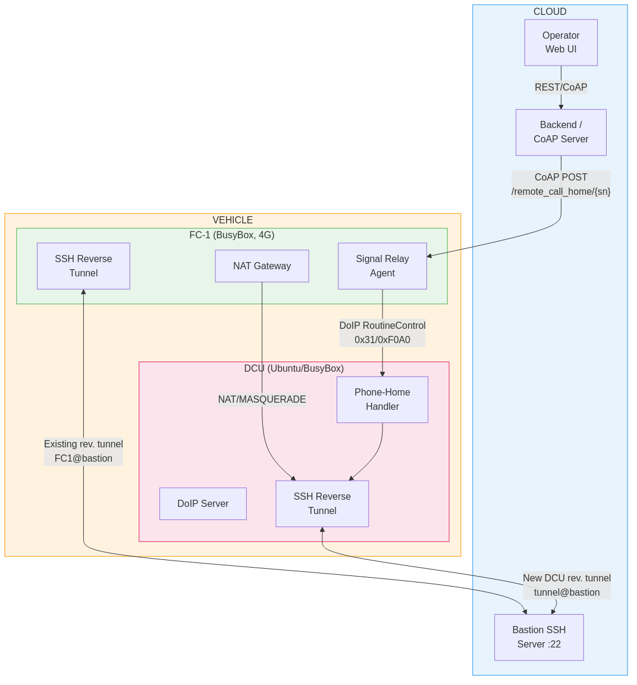
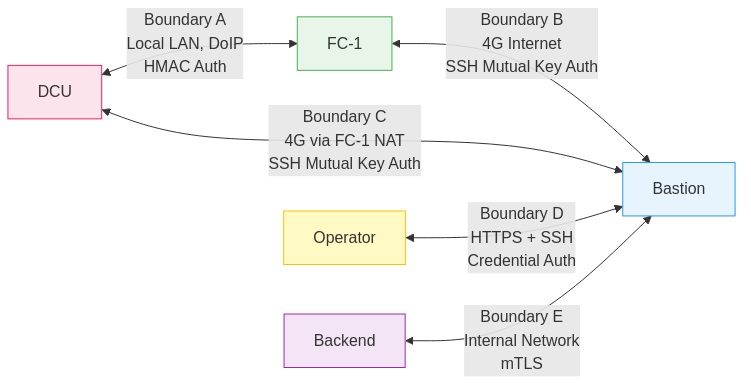
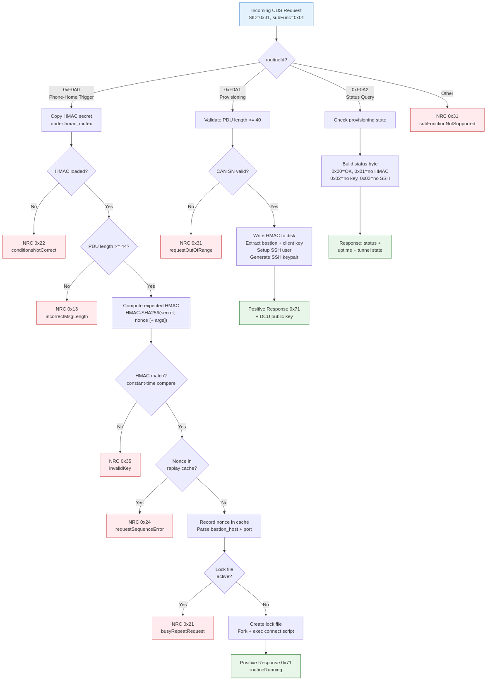
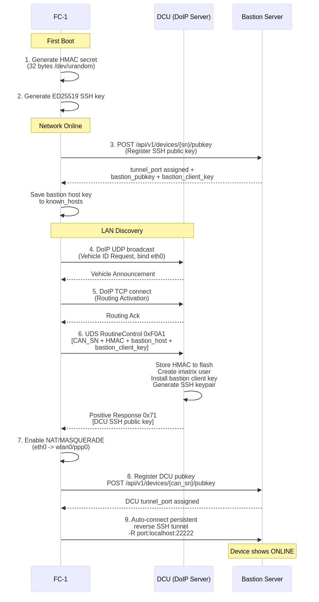
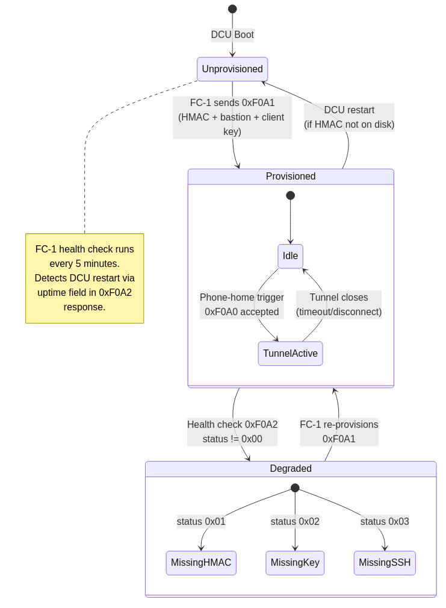
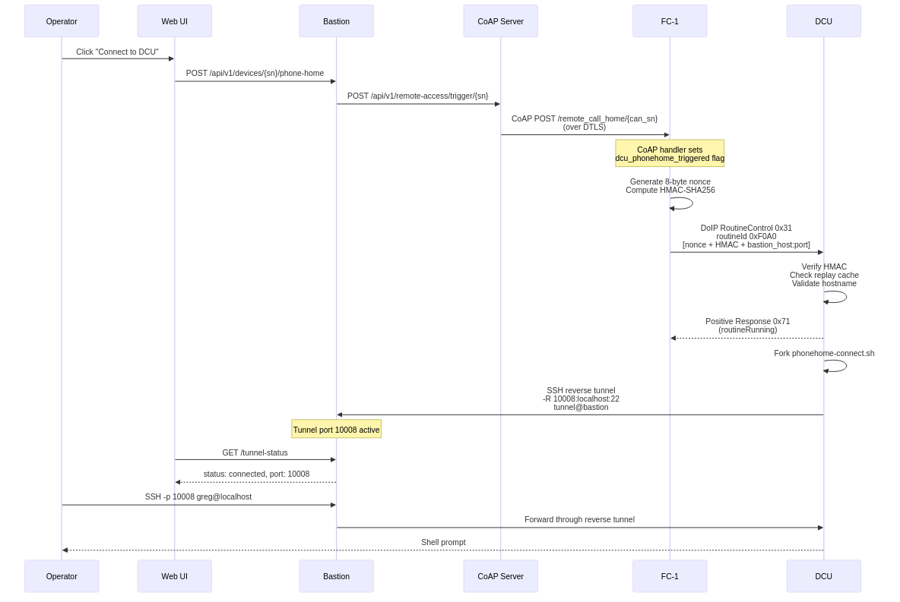
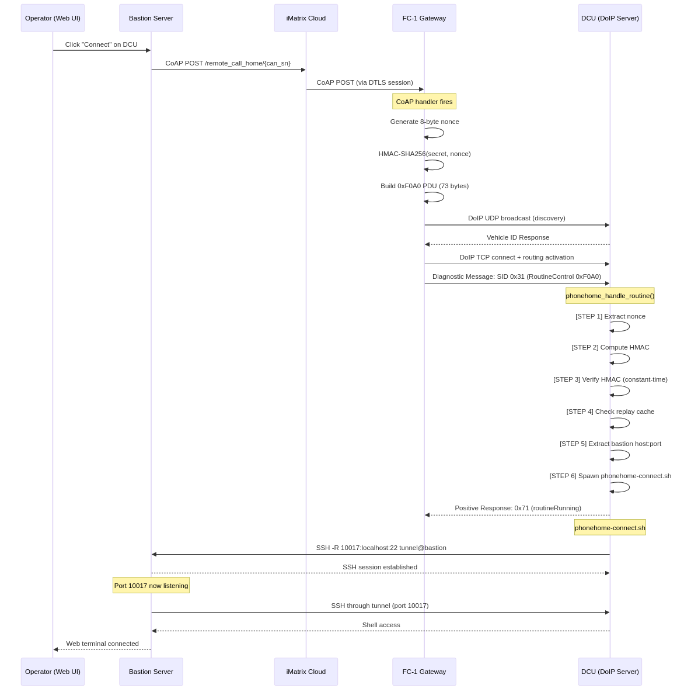
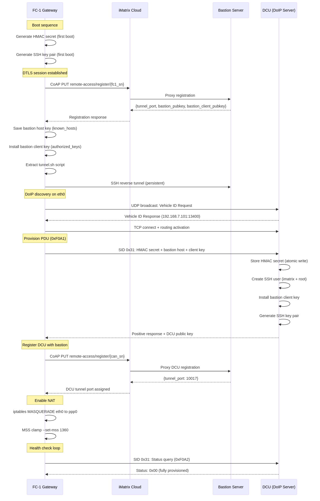
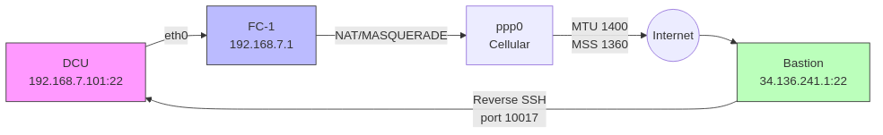
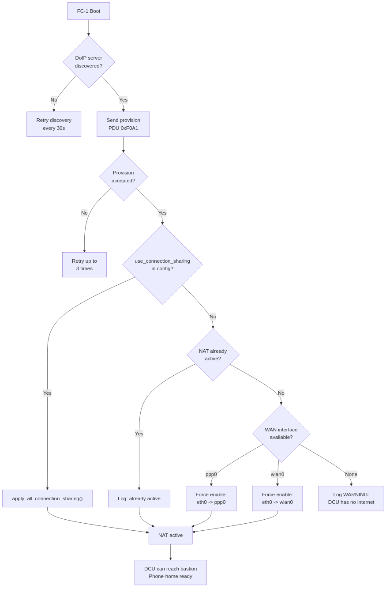

# DCU Phone-Home Capability — Developer Specification

**Version:** 3.0.0
**Status:** Implementation Complete — End-to-end validated 2026-03-27 (FC-1 + DCU + Bastion web terminal)
**Applies To:** FC-1 (BusyBox 4G Telematics Gateway), DCU (Diagnostic Control Unit, Ubuntu/BusyBox embedded), Bastion Server
**Standards:** ISO 13400 (DoIP), ISO 21434, UNECE WP.29, RFC 4253 (SSH)

---

## Table of Contents

1. [Document Purpose](#1-document-purpose)
2. [Glossary](#2-glossary)
3. [System Architecture](#3-system-architecture)
4. [Security Model and Key Management](#4-security-model-and-key-management)
5. [Component Specifications](#5-component-specifications)
   - 5.1 [DCU: Key Generation and Storage](#51-dcu-key-generation-and-storage)
   - 5.2 [DCU: Bastion Registration](#52-dcu-bastion-registration)
   - 5.3 [DCU: Phone-Home SSH Client Script](#53-dcu-phone-home-ssh-client-script)
   - 5.4 [DCU: DoIP Phone-Home Service Handler](#54-dcu-doip-phone-home-service-handler)
   - 5.5 [FC-1: Signal Relay Agent](#55-fc-1-signal-relay-agent)
   - 5.6 [Bastion: Registration API](#56-bastion-registration-api)
   - 5.7 [Bastion: Signal Dispatcher](#57-bastion-signal-dispatcher)
   - 5.8 [Backend/CoAP Server: Operator Trigger API](#58-backendcoap-server-operator-trigger-api)
6. [DoIP Integration](#6-doip-integration)
   - 6.1 [Custom Routine Control Service](#61-custom-routine-control-service)
   - 6.2 [Integration into Existing DoIP Server](#62-integration-into-existing-doip-server)
   - 6.3 [Replay Protection and HMAC](#63-replay-protection-and-hmac)
7. [Provisioning Flow](#7-provisioning-flow)
8. [Operational Phone-Home Flow](#8-operational-phone-home-flow)
9. [Configuration Reference](#9-configuration-reference)
10. [Error Handling and Edge Cases](#10-error-handling-and-edge-cases)
11. [Testing Procedures](#11-testing-procedures)
    - 11.1 [Unit Tests](#111-unit-tests)
    - 11.2 [Integration Tests](#112-integration-tests)
    - 11.3 [End-to-End Tests](#113-end-to-end-tests)
    - 11.4 [Security Tests](#114-security-tests)
    - 11.5 [Fleet Regression Test](#115-fleet-regression-test)
12. [Debugging Guide — Protocol Log Reference](#12-debugging-guide--protocol-log-reference)
    - 12.1 [Enabling Debug Output](#121-enabling-debug-output)
    - 12.2 [Provisioning Flow — Expected Log Output](#122-provisioning-flow--expected-log-output)
    - 12.3 [Phone-Home Trigger Flow — Expected Log Output](#123-phone-home-trigger-flow--expected-log-output)
    - 12.4 [Health Check Flow — Expected Log Output](#124-health-check-flow--expected-log-output)
    - 12.5 [Common Failure Patterns](#125-common-failure-patterns)
    - 12.6 [Flow Diagrams](#126-flow-diagrams)
13. [Recommended Source Files and Dependencies](#13-recommended-source-files-and-dependencies)
14. [Open Issues and Decision Log](#14-open-issues-and-decision-log)

---

## 1. Document Purpose

This specification defines all software components, interfaces, data formats, and test procedures required to implement a **phone-home capability** for a Diagnostic Control Unit (DCU) located behind the FC-1 4G telematics gateway.

The phone-home capability allows an operator, via a web UI, to establish an on-demand reverse SSH session to a DCU that has no publicly routable IP address. The design satisfies:

- **ISO 21434** cryptographic key confidentiality (private keys never leave the originating device)
- **UNECE WP.29** cybersecurity management system requirements for remote access
- Operational requirements for a large fleet (100s–1000s of units)

This document is intended for developers implementing the solution. It assumes familiarity with SSH, DoIP (ISO 13400), Linux shell scripting, and embedded systems programming.

---

## 2. Glossary

| Term | Definition |
|---|---|
| **DCU** | Diagnostic Control Unit. Vehicle ECU/gateway running Ubuntu or BusyBox in an embedded environment. Runs a DoIP server. |
| **FC-1** | Field Controller 1. BusyBox-based 4G telematics gateway. Acts as NAT gateway for the DCU. Already has its own phone-home / reverse SSH tunnel to the Bastion. |
| **Bastion** | The cloud-hosted SSH bastion server. Accepts inbound reverse SSH tunnels from both FC-1 and DCU. Provides operator access to tunneled devices. |
| **DoIP** | Diagnostics over IP (ISO 13400-2). The transport and application protocol used by the DCU's diagnostic server. |
| **UDS** | Unified Diagnostic Services (ISO 14229). Diagnostic service layer used over DoIP. |
| **SID** | Service Identifier. One-byte code identifying a UDS service. |
| **RoutineControl** | UDS service 0x31. Used here to carry the phone-home trigger command. |
| **routineIdentifier** | Two-byte sub-identifier within RoutineControl. 0xF0A0 is reserved for this phone-home function. |
| **Reverse SSH Tunnel** | An SSH connection initiated by the device (outbound) that makes a port on the Bastion forward inbound connections back to the device. |
| **HMAC** | Hash-based Message Authentication Code. Used to authenticate DoIP phone-home trigger messages. |
| **ED25519** | Elliptic curve SSH key algorithm. Preferred for embedded environments: compact keys, fast operations, strong security. |
| **Serial Number** | Unique device identifier. Both FC-1 and DCU have independent serial numbers. |
| **CoAP** | Constrained Application Protocol. Used by the backend server for lightweight IoT signaling. |

---

## 3. System Architecture

### 3.1 High-Level Topology



### 3.2 Trust Boundaries



**Critical invariant:** FC-1 is within the trust boundary for signaling (Boundary A and B) but is **never** in the cryptographic trust chain for DCU sessions (Boundary C). A compromised FC-1 can send a spurious phone-home trigger, but cannot read or intercept the DCU's SSH session.

### 3.3 Component Ownership

| Component | Owner | Language / Environment |
|---|---|---|
| DCU DoIP Server | Existing codebase (controlled) | C/C++ or Python |
| DCU Phone-Home Service Handler | **New — this spec** | C/C++ plugin or Python module |
| DCU phone-home shell script | **New — this spec** | POSIX sh (BusyBox-compatible) |
| DCU key provisioning script | **New — this spec** | POSIX sh |
| FC-1 Signal Relay Agent | **New — this spec** | POSIX sh / Python |
| Bastion Registration API | **New — this spec** | Python (FastAPI) or Node.js |
| Bastion Signal Dispatcher | **New — this spec** | Python / shell |
| Backend CoAP wake endpoint | **New — this spec** | Existing backend, add endpoint |

---

## 4. Security Model and Key Management

### 4.1 Cryptographic Assets

| Asset | Owner | Algorithm | Storage Location | Never Leaves |
|---|---|---|---|---|
| DCU private key | DCU | ED25519 | `/etc/phonehome/id_ed25519` (600, root) | DCU filesystem |
| DCU public key | DCU → Bastion | ED25519 | Registered at Bastion | N/A (public) |
| FC-1 private key | FC-1 | ED25519 | `/etc/phonehome/id_ed25519` | FC-1 filesystem |
| FC-1 public key | FC-1 → Bastion | ED25519 | Registered at Bastion | N/A (public) |
| Bastion host public key | Bastion | ED25519 | Pinned in firmware / config | N/A (public) |
| HMAC shared secret | FC-1 + DCU | HMAC-SHA256 | `/etc/phonehome/hmac_secret` (600, root) | Neither device |

### 4.2 Key Generation Policy

- Algorithm: **ED25519** on all devices. Do not use RSA. ED25519 keys are 68 bytes, fast to generate on embedded hardware, and provide 128-bit equivalent security.
- Keys are generated **on the device that will use them**, on first boot, before any network communication.
- Key generation must be seeded from a hardware entropy source. On Linux, read from `/dev/random` (blocking) for key generation, not `/dev/urandom`. Verify `/proc/sys/kernel/random/entropy_avail` > 256 before generating.
- After generation, the private key file permissions must be set to `0600`, owned by root. Verify this in the provisioning script.

### 4.3 Bastion Host Key Pinning

The Bastion's ED25519 host public key must be **embedded in the device firmware at build time** and written to `/etc/phonehome/known_hosts` during OS image build. It must not be fetched dynamically. The SSH client must be invoked with `-o StrictHostKeyChecking=yes` and `-o UserKnownHostsFile=/etc/phonehome/known_hosts`.

If the Bastion host key is rotated (planned key rotation), a firmware update must distribute the new host key before the old one expires. Overlap period of at minimum 30 days is required.

### 4.4 HMAC Shared Secret (FC-1 ↔ DCU)

The HMAC secret is a 32-byte random value provisioned at manufacture, identical on both FC-1 and the paired DCU. It authenticates DoIP phone-home trigger messages from FC-1 to DCU, ensuring a spoofed device on the local LAN cannot trigger a phone-home. The secret must be different for every FC-1/DCU pair.

Provisioning method: FC-1 auto-generates a 32-byte random HMAC secret on first boot (from /dev/urandom) and delivers it to the DCU via DoIP RoutineControl 0xF0A1 provisioning PDU. The secret is stored at /usr/qk/etc/sv/FC-1/hmac_secret (FC-1, yaffs2) and /etc/phonehome/hmac_secret (DCU). No manufacturing step is required.

---

## 5. Component Specifications

### 5.1 DCU: Key Generation and Storage

**File:** `/usr/sbin/phonehome-keygen.sh`  
**Invocation:** Called by systemd service `phonehome-keygen.service` on first boot (runs once, guarded by sentinel file).

```sh
#!/bin/sh
# phonehome-keygen.sh
# Generates DCU SSH key pair for phone-home function.
# MUST run before any network interfaces are brought up (Before=network.target).
# Complies with ISO 21434 key generation requirements.

set -e

PHONEHOME_DIR="/etc/phonehome"
KEY_FILE="${PHONEHOME_DIR}/id_ed25519"
SENTINEL="${PHONEHOME_DIR}/.keygen_complete"
SERIAL_FILE="/etc/dcu-serial"   # Written at manufacture / EOL programming
LOG_TAG="phonehome-keygen"

log() { logger -t "$LOG_TAG" "$1"; }

# Abort if already done
[ -f "$SENTINEL" ] && { log "Keys already generated. Exiting."; exit 0; }

# Ensure directory exists and is protected
install -d -m 700 -o root -g root "$PHONEHOME_DIR"

# Verify sufficient entropy before generating keys
ENTROPY=$(cat /proc/sys/kernel/random/entropy_avail)
if [ "$ENTROPY" -lt 256 ]; then
    log "ERROR: Insufficient entropy ($ENTROPY bits). Cannot generate keys safely."
    exit 1
fi

# Read device serial number
if [ ! -f "$SERIAL_FILE" ]; then
    log "ERROR: Serial number file not found at $SERIAL_FILE"
    exit 1
fi
DCU_SERIAL=$(cat "$SERIAL_FILE" | tr -d '[:space:]')

# Generate ED25519 key pair (no passphrase; service account usage)
ssh-keygen -t ed25519 -f "$KEY_FILE" -N "" -C "dcu-${DCU_SERIAL}"

# Enforce permissions
chmod 600 "$KEY_FILE"
chmod 644 "${KEY_FILE}.pub"
chown root:root "$KEY_FILE" "${KEY_FILE}.pub"

# Write sentinel
touch "$SENTINEL"
chmod 600 "$SENTINEL"

log "Key generation complete for DCU serial: $DCU_SERIAL"
log "Public key: $(cat ${KEY_FILE}.pub)"
```

**Systemd unit: `/etc/systemd/system/phonehome-keygen.service`**

```ini
[Unit]
Description=DCU Phone-Home SSH Key Generation (one-time)
Before=network-pre.target phonehome-register.service
ConditionPathExists=!/etc/phonehome/.keygen_complete
DefaultDependencies=no

[Service]
Type=oneshot
ExecStart=/usr/sbin/phonehome-keygen.sh
RemainAfterExit=yes
StandardOutput=journal
StandardError=journal

[Install]
WantedBy=multi-user.target
```

---

### 5.2 DCU: Bastion Registration (via FC-1 Proxy)

The DCU does **not** register directly with the bastion. Instead, the FC-1 acts
as a registration proxy:

1. FC-1 registers the DCU's SSH public key with the bastion via CoAP PUT
   over its existing DTLS session to the iMatrix cloud
2. The iMatrix cloud proxies the CoAP message to the bastion server
3. The bastion assigns a tunnel port and returns it in the CoAP response
4. FC-1 stores the DCU's tunnel port for use in phone-home relay PDUs

**CoAP Registration (FC-1 → iMatrix Cloud → Bastion):**

```
PUT remote-access/register/{can_sn}
Content-Format: application/json

{"pubkey": "ssh-ed25519 AAAA... dcu-{can_sn}", "target": "dcu"}
```

**Response:**

```json
{
    "status": "ok",
    "tunnel_port": 10016,
    "bastion_pubkey": "ssh-ed25519 AAAA... bastion",
    "bastion_client_pubkey": "ssh-ed25519 AAAA... bastion"
}
```

This design eliminates the need for provisioning tokens, direct HTTPS from the
DCU, or any manufacturing-time credential injection. The FC-1's authenticated
DTLS session provides the trust chain.

**Comparison: FC-1 vs DCU Registration**

| Aspect | FC-1 (Gateway) | DCU (via FC-1 proxy) |
|--------|----------------|---------------------|
| Transport | CoAP PUT over DTLS | CoAP PUT over DTLS (same FC-1 session) |
| URI | `remote-access/register/{fc1_sn}` | `remote-access/register/{can_sn}` |
| Target field | `"gateway"` | `"dcu"` |
| Authentication | DTLS session (iMatrix cloud) | Same FC-1 DTLS session (proxy) |
| Who initiates | FC-1 during INITIALIZING state | FC-1 during IDLE state (after DCU pubkey received) |
| Public key source | FC-1's `/usr/qk/etc/sv/FC-1/tunnel-key.pub` | DCU's `/etc/phonehome/id_ed25519.pub` (received via DoIP) |
| Tunnel port stored | FC-1 `ctx.tunnel_port` | FC-1 `ctx.dcu_tunnel_port` (for relay PDU) |
| Direct bastion contact | Yes (reverse SSH tunnel) | Only for SSH tunnel (not registration) |

The `phonehome-register.sh` script described in the original specification is
**not used**. Registration is handled entirely in C code within
`Fleet-Connect-1/remote_access/remote_access.c`.

---

### 5.3 DCU: Phone-Home SSH Client Script

**File:** `/usr/sbin/phonehome-connect.sh`  
**Invocation:** Called by the DoIP Phone-Home Service Handler when a valid trigger is received.

```sh
#!/bin/sh
# phonehome-connect.sh
# Opens a reverse SSH tunnel to the Bastion server.
# Called with: phonehome-connect.sh <bastion_host> <remote_port> <nonce>
#
# Arguments:
#   $1 - Bastion hostname or IP (should match pinned known_hosts entry)
#   $2 - Remote port on Bastion for reverse tunnel (0 = server auto-assigns)
#   $3 - Nonce from the DoIP trigger (logged for audit trail)

set -e

BASTION_HOST="${1:-bastion-dev.imatrixsys.com}"
REMOTE_PORT="${2:-0}"
NONCE="$3"
LOCAL_SSH_PORT=22
PHONEHOME_DIR="/etc/phonehome"
KEY_FILE="${PHONEHOME_DIR}/id_ed25519"
KNOWN_HOSTS="${PHONEHOME_DIR}/known_hosts"
SERIAL_FILE="/etc/dcu-serial"
DCU_SERIAL=$(cat "$SERIAL_FILE" | tr -d '[:space:]')
LOG_TAG="phonehome-connect"
TUNNEL_TIMEOUT=3600   # Max tunnel lifetime in seconds (1 hour)
LOCK_FILE="/var/run/phonehome.lock"

log() { logger -t "$LOG_TAG" "$1"; }

# Prevent concurrent tunnels
if [ -f "$LOCK_FILE" ]; then
    PID=$(cat "$LOCK_FILE")
    if kill -0 "$PID" 2>/dev/null; then
        log "Tunnel already active (PID $PID). Ignoring duplicate trigger."
        exit 0
    fi
fi

echo $$ > "$LOCK_FILE"
trap 'rm -f "$LOCK_FILE"; log "Tunnel closed."' EXIT

log "Phone-home triggered. Serial=$DCU_SERIAL Nonce=$NONCE Bastion=$BASTION_HOST RemotePort=$REMOTE_PORT"

# Validate key files exist
[ -f "$KEY_FILE" ] || { log "ERROR: Private key not found at $KEY_FILE"; exit 1; }
[ -f "$KNOWN_HOSTS" ] || { log "ERROR: known_hosts not found at $KNOWN_HOSTS"; exit 1; }

# Open reverse SSH tunnel
# -N: no remote command
# -T: no TTY allocation
# -R: reverse tunnel (remote_port:localhost:local_ssh_port)
# -o ExitOnForwardFailure=yes: fail immediately if port binding fails
# timeout: hard kill after TUNNEL_TIMEOUT seconds

timeout "$TUNNEL_TIMEOUT" ssh \
    -N -T \
    -i "$KEY_FILE" \
    -o StrictHostKeyChecking=yes \
    -o UserKnownHostsFile="$KNOWN_HOSTS" \
    -o ExitOnForwardFailure=yes \
    -o ServerAliveInterval=30 \
    -o ServerAliveCountMax=3 \
    -o BatchMode=yes \
    -o ConnectTimeout=30 \
    -R "${REMOTE_PORT}:localhost:${LOCAL_SSH_PORT}" \
    "phonehome-${DCU_SERIAL}@${BASTION_HOST}" \
    || log "SSH tunnel exited with code $?"
```

**Notes for developers:**
- The SSH username format `phonehome-<DCU_SERIAL>` is how the Bastion identifies the device. The Bastion's `authorized_keys` for each device user is configured with `command=""` and `restrict` options to limit what the connecting device can do.
- `REMOTE_PORT=0` instructs the SSH server to auto-assign an ephemeral port. The Bastion's signal dispatcher must read the assigned port from the SSH server and communicate it back to the operator. See Section 5.7.
- `timeout` must be available on the target. On BusyBox, use `timeout` applet. On Ubuntu, it is in `coreutils`.

---

### 5.4 DCU: DoIP Phone-Home Service Handler

This is the **new code** to be integrated into the existing DCU DoIP server. See Section 6 for full DoIP integration details.

#### UDS RoutineControl Handler Flow

The following flowchart shows the complete dispatch and validation logic for all three routine identifiers (0xF0A0 trigger, 0xF0A1 provisioning, 0xF0A2 status query):



**Logical specification** (language-agnostic, adapt to your DoIP server's plugin/handler architecture):

```
Handler: PhoneHomeRoutineControl

Triggers on:
    SID = 0x31 (RoutineControl)
    subFunction = 0x01 (startRoutine)
    routineIdentifier = 0xF0A0

Request PDU format (after UDS header):
    Byte 0:     SID (0x31)
    Byte 1:     subFunction (0x01)
    Bytes 2-3:  routineIdentifier (0xF0, 0xA0)
    Bytes 4-11: Nonce (8 bytes, random, used for replay protection)
    Bytes 12-43: HMAC-SHA256 digest (32 bytes)
                 HMAC key: shared secret from /etc/phonehome/hmac_secret
                 HMAC input: Nonce bytes (bytes 4-11)

Handler logic:
    1. Extract nonce (bytes 4-11)
    2. Extract HMAC digest (bytes 12-43)
    3. Compute expected HMAC = HMAC-SHA256(hmac_secret, nonce)
    4. Compare expected HMAC to received HMAC using constant-time comparison
       (to prevent timing attacks)
    5. If HMAC mismatch: respond with NRC 0x35 (invalidKey) and log security event
    6. Check nonce against replay cache (see below)
    7. If nonce replay detected: respond with NRC 0x24 (requestSequenceError)
    8. Add nonce to replay cache with TTL = 300 seconds
    9. Extract optional bastion_host (bytes 44+, UTF-8, null-terminated, max 253 chars)
       If absent: use compiled-in default from config
    10. Extract optional remote_port (2 bytes at offset 44+len(bastion_host)+1)
        If absent: use 0 (auto-assign)
    11. Spawn /usr/sbin/phonehome-connect.sh <bastion_host> <remote_port> <nonce_hex>
        as a detached child process (do not wait for SSH to complete)
    12. Respond with positive response: SID+0x40=0x71, subFunction 0x01,
        routineIdentifier 0xF0A0, routineStatus=0x02 (routineRunning)

Replay Cache:
    In-memory circular buffer, capacity 64 entries.
    Each entry: { nonce: bytes[8], expiry: unix_timestamp }
    On lookup: evict expired entries, then search for matching nonce.
    Thread-safe: protect with mutex if DoIP server is multi-threaded.

Positive Response PDU:
    Byte 0: 0x71
    Byte 1: 0x01
    Bytes 2-3: 0xF0 0xA0
    Byte 4: 0x02  (routineRunning — tunnel is initiating asynchronously)

NRC Response PDU (on error):
    Byte 0: 0x7F
    Byte 1: 0x31
    Byte 2: <NRC code>
```

---

### 5.5 FC-1: Signal Relay and DCU Provisioning

**File:** `Fleet-Connect-1/remote_access/remote_access.c`
**Invocation:** Integrated into the FC-1 main loop. Runs automatically — no external script or manual trigger required.

#### 5.5.1 HMAC Secret Management

The HMAC secret is auto-generated on first boot if not present:

```c
// In init_load_hmac_secret():
// 1. Try to load from /usr/qk/etc/sv/FC-1/hmac_secret
// 2. If not found: generate 32 bytes from /dev/urandom
// 3. Write atomically (temp file + rename) with mode 0600
// 4. Load into ctx.hmac_secret[32]
```

**Storage:** `/usr/qk/etc/sv/FC-1/hmac_secret` (yaffs2, persistent across reboots)
**Permissions:** 0600 (root read/write only)

#### 5.5.2 DCU Provisioning (routineId 0xF0A1)

After the DoIP TCP connection is established and the CAN controller serial number
is available, the FC-1 sends a 40-byte UDS provisioning PDU:

| Offset | Length | Field |
|--------|--------|-------|
| 0 | 1 | SID: 0x31 (RoutineControl) |
| 1 | 1 | Sub-function: 0x01 (startRoutine) |
| 2-3 | 2 | Routine ID: 0xF0A1 (provision) |
| 4-7 | 4 | CAN controller serial number (big-endian uint32) |
| 8-39 | 32 | HMAC-SHA256 shared secret |

The DCU stores the secret atomically and responds with a 5-byte positive response:
`0x71 0x01 0xF0 0xA1 0x00` (routineAccepted).

Provisioning runs once per FC-1 power cycle (max 3 UDS-level retries; transport
errors do not count against the retry limit).

#### 5.5.3 DCU Phone-Home Relay (routineId 0xF0A0)

When the FC-1 receives a CoAP POST to `/remote_call_home/{can_sn}` from the
bastion (via the iMatrix CoAP infrastructure), it relays the trigger to the DCU:

| Offset | Length | Field |
|--------|--------|-------|
| 0 | 1 | SID: 0x31 (RoutineControl) |
| 1 | 1 | Sub-function: 0x01 (startRoutine) |
| 2-3 | 2 | Routine ID: 0xF0A0 (phone-home trigger) |
| 4-11 | 8 | Nonce (random, from /dev/urandom) |
| 12-43 | 32 | HMAC-SHA256(secret, nonce) |

The relay is rate-limited to once per 60 seconds. Uses a static `doip_client_t`
to avoid stack allocation on embedded. Fire-and-forget: logs result, no retry.

#### 5.5.4 Persistent Tunnel

After bastion registration, the FC-1 automatically establishes a persistent
reverse SSH tunnel using `dbclient` (Dropbear SSH client):

- Reverse port: `127.0.0.1:<tunnel_port>` → `127.0.0.1:22222` (FC-1 SSH)
- Keepalive: 10 seconds (aggressive for cellular NAT)
- MTU: ppp0 set to 1400 on connect (prevents PMTU black hole on cellular)
- tcp_mtu_probing: enabled on ppp0 connect (kernel PMTU discovery safety net)
- Re-trigger: phone-home triggers while CONNECTED are ignored (prevents tunnel teardown during bastion web-ssh connect)
- TTL: 3600 seconds (auto-rotated)
- Host key: always TOFU (-y), stale known_hosts entries auto-cleared
- On disconnect: auto-reconnect after 60-second cooldown
- On TTL expiry: immediate reconnect (tunnel rotation)

**Tunnel script:** `Fleet-Connect-1/remote_access/tunnel.sh` (embedded in binary,
extracted to `/usr/qk/etc/sv/FC-1/scripts/tunnel.sh` at runtime)

#### 5.5.5 Bastion Client Key Installation

When the bastion registration response includes `bastion_client_pubkey`, the FC-1
installs it in `/root/.ssh/authorized_keys` on both itself and the DCU (via
provisioning PDU). This enables the bastion web-ssh app to authenticate through
the reverse tunnel using key auth instead of password, which is critical because:

- Dropbear has limited concurrent connection capacity
- Key auth completes instantly vs password round-trip over cellular
- Eliminates failed key auth attempts consuming Dropbear's `-T` limit

**File:** `/root/.ssh/authorized_keys` (FC-1), `/home/imatrix/.ssh/authorized_keys` (DCU)
**Permissions:** 0600
**Compare-before-write:** avoids unnecessary flash writes on yaffs2

---

### 5.6 Bastion: Registration API

Registration is handled by the bastion web-ssh app (`app.py`) via the
`/api/v1/devices/{device_id}/pubkey` endpoint, which receives CoAP-proxied
requests from the iMatrix cloud.

The bastion:
1. Stores the device's SSH public key in Redis (`device:{sn}:ssh_pubkey`)
2. Appends the key to the `tunnel` user's `authorized_keys` file
3. Assigns a unique reverse tunnel port from the configured range
4. Returns the tunnel port and bastion's own SSH keys in the response

**No provisioning tokens or JWT authentication is used.** The iMatrix cloud's
CoAP proxy authenticates the request implicitly via the FC-1's DTLS session.

The `registration_api.py`, `provisioning_token`, and `schema.sql` described in
the original specification were superseded by the CoAP/Redis-based approach.

---

### 5.7 Bastion: Signal Dispatcher

The Bastion signal dispatcher receives a wake request from the backend, uses the FC-1's existing reverse tunnel to call `phonehome-relay.sh` on FC-1, and monitors for the DCU's inbound reverse tunnel.

```python
# signal_dispatcher.py

import subprocess
import time
import sqlite3
import logging

DB_PATH = "/var/lib/phonehome/devices.db"
SSH_KEY = "/etc/phonehome/bastion_relay_key"   # Bastion's key for reaching FC-1 via tunnel
LOG = logging.getLogger("signal_dispatcher")

def get_fc1_tunnel_port(fc1_serial: str) -> int:
    """
    Returns the local port on the Bastion that FC-1's reverse tunnel is listening on.
    This is maintained by a separate tunnel-monitor process that reads sshd logs
    or uses the SSH multiplexer API.
    """
    # Implementation: query a local state file / Redis / SQLite that is
    # updated by the tunnel-monitor daemon.
    raise NotImplementedError("Implement tunnel port lookup for FC-1")

def dispatch_wake(dcu_serial: str, operator_id: str) -> dict:
    """
    Sends a phone-home signal to the specified DCU via FC-1's reverse tunnel.
    Returns the assigned remote port for the operator to connect to.
    """
    con = sqlite3.connect(DB_PATH)
    row = con.execute(
        "SELECT fc1_serial FROM devices WHERE serial=? AND device_type='DCU'",
        (dcu_serial,)
    ).fetchone()
    con.close()

    if not row:
        raise ValueError(f"Unknown DCU serial: {dcu_serial}")

    fc1_serial = row[0]
    fc1_port = get_fc1_tunnel_port(fc1_serial)

    LOG.info(f"Dispatching wake for DCU {dcu_serial} via FC-1 {fc1_serial} on port {fc1_port}")

    # SSH into FC-1 via its reverse tunnel and execute phonehome-relay.sh
    result = subprocess.run([
        "ssh",
        "-i", SSH_KEY,
        "-o", "StrictHostKeyChecking=yes",
        "-o", "UserKnownHostsFile=/etc/phonehome/fc1_known_hosts",
        "-o", "BatchMode=yes",
        "-o", "ConnectTimeout=15",
        "-p", str(fc1_port),
        f"relay-{fc1_serial}@localhost",
        f"/usr/sbin/phonehome-relay.sh {dcu_serial} bastion-dev.imatrixsys.com 0"
    ], capture_output=True, text=True, timeout=30)

    if result.returncode != 0:
        raise RuntimeError(f"Relay failed: {result.stderr}")

    # Wait for DCU's reverse tunnel to appear (poll for up to 60s)
    assigned_port = wait_for_dcu_tunnel(dcu_serial, timeout=60)
    if not assigned_port:
        raise TimeoutError(f"DCU {dcu_serial} did not connect within 60 seconds")

    # Log the event
    con = sqlite3.connect(DB_PATH)
    con.execute("""
        INSERT INTO phone_home_log (serial, operator_id, requested_at, connected_at, remote_port, outcome)
        VALUES (?, ?, datetime('now'), datetime('now'), ?, 'connected')
    """, (dcu_serial, operator_id, assigned_port))
    con.commit()
    con.close()

    return {"dcu_serial": dcu_serial, "bastion_host": "bastion-dev.imatrixsys.com", "port": assigned_port}

def wait_for_dcu_tunnel(dcu_serial: str, timeout: int = 60) -> int:
    """
    Polls the SSH server (via ss/netstat or sshd log parsing) to detect
    the DCU's reverse tunnel port becoming active.
    Returns the port number or None on timeout.
    """
    # Implementation: the SSH server is configured with AuthorizedKeysFile pointing
    # to per-device files. Use `ss -tlnp` or parse `/var/log/auth.log` to detect
    # when phonehome-<dcu_serial> user connects and which port they bind.
    # Alternatively: use OpenSSH's StreamLocalBindUnlink + a Unix socket approach.
    raise NotImplementedError("Implement DCU tunnel port detection")
```

---

### 5.8 Backend/CoAP Server: Operator Trigger API

The operator trigger is sent via the bastion web UI or MCP tools. The bastion
sends a CoAP phone-home request to the FC-1 via the iMatrix cloud infrastructure.
The FC-1's CoAP handler receives the trigger on `/remote_call_home/{can_sn}`
and relays it to the DCU via DoIP RoutineControl 0xF0A0.

```
POST /api/v1/phonehome/wake

Authorization: Bearer <operator JWT>

Request body:
{
    "dcu_serial": "DCU-XXXXXXXX"
}

Response (202 Accepted, async):
{
    "status": "dispatched",
    "dcu_serial": "DCU-XXXXXXXX",
    "poll_url": "/api/v1/phonehome/status/DCU-XXXXXXXX"
}

Response (200 OK, when tunnel is ready):
{
    "status": "ready",
    "dcu_serial": "DCU-XXXXXXXX",
    "bastion_host": "bastion-dev.imatrixsys.com",
    "port": 34521,
    "expires_at": "2024-01-01T12:00:00Z"
}
```

The backend calls `signal_dispatcher.dispatch_wake()` synchronously or asynchronously, then the UI polls `/status/` until `"status": "ready"` is returned.

---

## 6. DoIP Integration

### 6.1 Custom Routine Control Service

The phone-home trigger uses UDS service 0x31 (RoutineControl) with a vendor-specific `routineIdentifier` in the range 0xF000–0xFFFF. The assigned identifier for this function is **0xF0A0**.

| Field | Value | Notes |
|---|---|---|
| SID | 0x31 | RoutineControl |
| subFunction | 0x01 | startRoutine |
| routineIdentifier | 0xF0A0 | Vendor-specific, phone-home |
| NRC on HMAC fail | 0x35 | invalidKey |
| NRC on replay | 0x24 | requestSequenceError |
| NRC on busy | 0x21 | busyRepeatRequest (tunnel already active) |

### 6.2 Integration into Existing DoIP Server

The following describes how to integrate the phone-home handler into a typical C/C++ DoIP server. Adapt to your actual codebase.

**Step 1: Register the handler.**

Locate the function in your DoIP server that dispatches incoming UDS requests based on SID. This is typically a switch/case or dispatch table. Add a registration call:

```c
// In your UDS dispatcher initialization:
uds_register_handler(
    SID_ROUTINE_CONTROL,          // 0x31
    SUB_FUNC_START_ROUTINE,       // 0x01
    ROUTINE_ID_PHONEHOME,         // 0xF0A0
    phonehome_routine_handler     // function pointer
);
```

**Step 2: Implement the handler function.**

```c
// phonehome_handler.c

#include <stdint.h>
#include <string.h>
#include <stdlib.h>
#include <unistd.h>
#include <openssl/hmac.h>
#include "uds_types.h"
#include "phonehome_handler.h"

#define NONCE_LEN       8
#define HMAC_LEN        32
#define PAYLOAD_OFFSET  4   // After SID + subFunc + routineIdentifier (2 bytes)
#define NONCE_OFFSET    PAYLOAD_OFFSET
#define HMAC_OFFSET     (NONCE_OFFSET + NONCE_LEN)
#define ARGS_OFFSET     (HMAC_OFFSET + HMAC_LEN)
#define REPLAY_CACHE_SIZE 64
#define NONCE_TTL_SECS  300

typedef struct {
    uint8_t nonce[NONCE_LEN];
    time_t  expiry;
} replay_entry_t;

static replay_entry_t replay_cache[REPLAY_CACHE_SIZE];
static int            replay_index = 0;
static pthread_mutex_t replay_mutex = PTHREAD_MUTEX_INITIALIZER;

static uint8_t hmac_secret[32];     // Loaded at startup from /etc/phonehome/hmac_secret
static int     hmac_secret_loaded = 0;

// Call this during DoIP server initialization
int phonehome_init(void) {
    FILE *f = fopen("/etc/phonehome/hmac_secret", "rb");
    if (!f) return -1;
    size_t n = fread(hmac_secret, 1, sizeof(hmac_secret), f);
    fclose(f);
    if (n != sizeof(hmac_secret)) return -1;
    hmac_secret_loaded = 1;
    return 0;
}

static int check_and_record_nonce(const uint8_t *nonce) {
    time_t now = time(NULL);
    pthread_mutex_lock(&replay_mutex);
    for (int i = 0; i < REPLAY_CACHE_SIZE; i++) {
        if (replay_cache[i].expiry > now &&
            memcmp(replay_cache[i].nonce, nonce, NONCE_LEN) == 0) {
            pthread_mutex_unlock(&replay_mutex);
            return -1;  // Replay detected
        }
    }
    // Evict oldest entry and record new nonce
    replay_cache[replay_index % REPLAY_CACHE_SIZE].expiry = now + NONCE_TTL_SECS;
    memcpy(replay_cache[replay_index % REPLAY_CACHE_SIZE].nonce, nonce, NONCE_LEN);
    replay_index++;
    pthread_mutex_unlock(&replay_mutex);
    return 0;
}

uds_response_t phonehome_routine_handler(const uint8_t *req, size_t req_len) {
    if (!hmac_secret_loaded) return uds_nrc(0x31, 0x22);  // conditionsNotCorrect
    if (req_len < ARGS_OFFSET) return uds_nrc(0x31, 0x13);  // incorrectMessageLength

    const uint8_t *nonce = req + NONCE_OFFSET;
    const uint8_t *rx_hmac = req + HMAC_OFFSET;

    // Compute expected HMAC
    uint8_t exp_hmac[HMAC_LEN];
    unsigned int exp_len = HMAC_LEN;
    HMAC(EVP_sha256(), hmac_secret, sizeof(hmac_secret),
         nonce, NONCE_LEN, exp_hmac, &exp_len);

    // Constant-time comparison (prevents timing side-channel)
    if (CRYPTO_memcmp(rx_hmac, exp_hmac, HMAC_LEN) != 0) {
        syslog(LOG_WARNING, "phonehome: HMAC verification failed — possible spoofing attempt");
        return uds_nrc(0x31, 0x35);  // invalidKey
    }

    // Replay protection
    if (check_and_record_nonce(nonce) != 0) {
        syslog(LOG_WARNING, "phonehome: Replayed nonce detected");
        return uds_nrc(0x31, 0x24);  // requestSequenceError
    }

    // Parse optional args: bastion_host (null-terminated) + port (uint16 BE)
    char bastion_host[254] = "bastion-dev.imatrixsys.com";  // default
    uint16_t remote_port = 0;
    if (req_len > ARGS_OFFSET) {
        size_t remaining = req_len - ARGS_OFFSET;
        const uint8_t *args = req + ARGS_OFFSET;
        size_t host_len = strnlen((const char *)args, remaining < 253 ? remaining : 253);
        if (host_len > 0 && host_len < 254) {
            memcpy(bastion_host, args, host_len);
            bastion_host[host_len] = '\0';
            size_t port_offset = host_len + 1;
            if (remaining >= port_offset + 2) {
                remote_port = (args[port_offset] << 8) | args[port_offset + 1];
            }
        }
    }

    // Format nonce as hex string for logging
    char nonce_hex[NONCE_LEN * 2 + 1];
    for (int i = 0; i < NONCE_LEN; i++)
        snprintf(nonce_hex + i*2, 3, "%02x", nonce[i]);

    syslog(LOG_INFO, "phonehome: Trigger received. Bastion=%s Port=%u Nonce=%s",
           bastion_host, remote_port, nonce_hex);

    // Spawn phone-home script as detached process
    char port_str[6], nonce_str[NONCE_LEN * 2 + 1];
    snprintf(port_str, sizeof(port_str), "%u", remote_port);
    memcpy(nonce_str, nonce_hex, sizeof(nonce_hex));

    pid_t pid = fork();
    if (pid == 0) {
        // Child: detach and exec
        setsid();
        execl("/usr/sbin/phonehome-connect.sh", "phonehome-connect.sh",
              bastion_host, port_str, nonce_str, NULL);
        _exit(1);
    } else if (pid < 0) {
        syslog(LOG_ERR, "phonehome: fork() failed");
        return uds_nrc(0x31, 0x22);  // conditionsNotCorrect
    }

    // Positive response: routineRunning
    uint8_t resp[] = { 0x71, 0x01, 0xF0, 0xA0, 0x02 };
    return uds_positive_response(resp, sizeof(resp));
}
```

**Step 3: Add to your build system.**

```makefile
# Add to your Makefile or CMakeLists.txt
SRCS += phonehome_handler.c
# No external crypto dependency — uses standalone FIPS 180-4 SHA-256 + RFC 2104 HMAC (hmac_sha256.c)
```

**Step 4: Call `phonehome_init()` during startup.**

```c
// In your main server initialization sequence:
if (phonehome_init() != 0) {
    syslog(LOG_ERR, "phonehome: Failed to load HMAC secret. Phone-home disabled.");
    // Do not abort the entire server — degrade gracefully.
}
```

### 6.3 Replay Protection and HMAC

The HMAC and nonce mechanism protects against two threat vectors:

1. **Spoofed trigger:** A rogue device on the vehicle LAN sends a crafted DoIP RoutineControl to trigger an unauthorized phone-home. Prevented by HMAC — attacker does not know the shared secret.

2. **Replay attack:** An attacker captures a legitimate DoIP trigger frame and retransmits it later. Prevented by nonce replay cache — the same 8-byte nonce cannot be used twice within 300 seconds.

The 8-byte nonce provides sufficient entropy for this use case. The 300-second TTL is intentionally conservative; the transit time for a DoIP frame on a local LAN is sub-millisecond.

---

## 7. Provisioning Flow

Provisioning is **fully automatic** — no manufacturing station or manual steps
are required. All cryptographic material is generated at first boot and
exchanged over authenticated channels.

### 7.1 Zero-Touch Provisioning Sequence



### 7.2 Provisioning Details

| Step | Component | Trigger | Storage | Persistence |
|------|-----------|---------|---------|-------------|
| HMAC generation | FC-1 `remote_access.c` | First boot (file not found) | `/usr/qk/etc/sv/FC-1/hmac_secret` | yaffs2 flash |
| SSH key generation | FC-1 `remote_access.c` | First boot (file not found) | `/usr/qk/etc/sv/FC-1/tunnel-key` | yaffs2 flash |
| Bastion registration | FC-1 `remote_access.c` | INITIALIZING state | Bastion database | Permanent |
| DoIP discovery | FC-1 `doip_process.c` | eth0 interface has IP | In-memory `g_doip` context | Per-boot |
| HMAC delivery to DCU | FC-1 `remote_access.c` | DoIP connected + HMAC loaded + CAN SN available | DCU `/etc/phonehome/hmac_secret` | DCU flash |
| NAT/MASQUERADE | FC-1 `connection_sharing.c` | After successful DCU provisioning | iptables rules + ip_forward | Per-boot (rules persist via iptables-save) |
| Persistent tunnel | FC-1 `remote_access.c` | After bastion registration | Active SSH connection | Maintained with auto-reconnect |

### 7.3 Provisioning State Machine

The following state diagram shows how the DCU transitions between provisioning states and how the FC-1 health check (0xF0A2) drives automatic re-provisioning:



### 7.4 Re-Provisioning Behavior

- **FC-1 reboot:** HMAC reloaded from flash. DCU re-provisioned on next DoIP connection. Tunnel re-established automatically.
- **DCU reboot (only):** HMAC reloaded from DCU flash. No re-provisioning needed unless HMAC file was lost.
- **HMAC file deleted on FC-1:** Auto-generated on next boot. DCU re-provisioned with the new secret.
- **HMAC file deleted on DCU:** FC-1 re-provisions on next DoIP connection (once per power cycle).
- **Bastion host key change:** Stale key auto-cleared from known_hosts before each tunnel connection. TOFU (-y) accepts the new key.

### 7.4 Prerequisites

The only requirements for provisioning to succeed:

1. FC-1 has network connectivity (WiFi or cellular) to reach the bastion server
2. DCU is running the DoIP server on the same LAN as FC-1 (eth0, 192.168.7.0/24)
3. CAN controller has provided a serial number (non-zero)

No manufacturing station, no manual configuration, no provisioning tokens.

---

## 8. Operational Phone-Home Flow

Step-by-step with timing expectations:



**Expected total latency:** 3–8 seconds from button click to operator prompt.

---

## 9. Configuration Reference

### 9.1 DCU Configuration File: `/etc/phonehome/phonehome.conf`

```ini
# /etc/phonehome/phonehome.conf
BASTION_HOST=bastion-dev.imatrixsys.com
BASTION_PORT=22
TUNNEL_TIMEOUT=3600
RETRY_ON_DISCONNECT=0
LOG_LEVEL=info
DOIP_SOURCE_ADDR=0x0001
```

### 9.2 FC-1 Configuration

The FC-1 does NOT use a configuration file for phone-home. All parameters are
derived automatically from the system:

| Parameter | Source | Value |
|-----------|--------|-------|
| Bastion host | iMatrix CoAP server (`imx_get_bastion_url()`) | `bastion-dev.imatrixsys.com` |
| Bastion port | iMatrix CoAP server (`imx_get_bastion_port()`) | `22` |
| Tunnel port | Assigned by bastion during registration | e.g., `10007` |
| HMAC secret | Auto-generated on first boot | `/usr/qk/etc/sv/FC-1/hmac_secret` |
| SSH key | Auto-generated on first boot | `/usr/qk/etc/sv/FC-1/tunnel-key` |
| DCU IP | Discovered via DoIP UDP broadcast on eth0 | e.g., `192.168.7.101` |
| CAN SN | Provided by CAN controller subsystem | e.g., `287906454` |
| Device serial | From device_config (set via `qr` command) | e.g., `0799874683` |

### 9.3 Bastion SSH Server Configuration (`/etc/ssh/sshd_config` additions)

```
# Separate match block for phone-home device users
Match User phonehome-*
    AllowTcpForwarding remote
    X11Forwarding no
    PermitTTY no
    PermitTunnel no
    GatewayPorts no
    AuthorizedKeysFile /etc/phonehome/authorized_keys/%u
    # ForceCommand must use sleep infinity, not /bin/false — /bin/false exits immediately causing sshd to tear down the session and its reverse port forwards after the grace period
    ForceCommand /usr/bin/sleep infinity
    ClientAliveInterval 15
    ClientAliveCountMax 3

# Separate match block for FC-1 relay users
Match User relay-*
    AllowTcpForwarding remote
    X11Forwarding no
    PermitTTY no
    AuthorizedKeysFile /etc/phonehome/authorized_keys/%u
    ForceCommand /usr/sbin/phonehome-relay-gate.sh
    ClientAliveInterval 15
    ClientAliveCountMax 3
```

---

## 10. Error Handling and Edge Cases

| Scenario | Detection | Response |
|---|---|---|
| DCU has no network (4G down) | SSH connect timeout (30s) | Log failure; DoIP handler already responded routineRunning; backend polls and times out; operator sees "Connection failed" |
| HMAC mismatch on DoIP trigger | HMAC comparison fails | NRC 0x35; security event logged; no tunnel initiated |
| Nonce replay on DoIP trigger | Nonce found in replay cache | NRC 0x24; event logged |
| Tunnel already active | Lock file present with live PID | phonehome-connect.sh exits immediately; DoIP handler checks lock before fork and returns NRC 0x21 |
| Bastion host key mismatch | StrictHostKeyChecking=yes fails | SSH exits non-zero; logged; no connection; security event |
| FC-1 offline | Dispatcher SSH command fails | dispatch_wake throws; backend returns 503 to UI |
| DCU first boot, no HMAC secret | phonehome_init() returns -1 or FC-1 re-provisions on health check | Phone-home disabled until FC-1 provisions HMAC secret via 0xF0A1 |

---

## 11. Testing Procedures

### 11.1 Unit Tests

#### UT-01: HMAC Validation — Valid Input

**Target:** `phonehome_routine_handler()`  
**Method:** Call handler with a correctly formed DoIP PDU including valid HMAC.  
**Expected:** Returns positive response `{0x71, 0x01, 0xF0, 0xA0, 0x02}`

```c
void test_hmac_valid(void) {
    uint8_t nonce[8] = {0x01,0x02,0x03,0x04,0x05,0x06,0x07,0x08};
    uint8_t hmac[32];
    unsigned int hmac_len = 32;
    HMAC(EVP_sha256(), test_secret, 32, nonce, 8, hmac, &hmac_len);

    uint8_t pdu[4 + 8 + 32] = {0x31, 0x01, 0xF0, 0xA0};
    memcpy(pdu + 4, nonce, 8);
    memcpy(pdu + 12, hmac, 32);

    uds_response_t r = phonehome_routine_handler(pdu, sizeof(pdu));
    assert(r.data[0] == 0x71);
    assert(r.data[4] == 0x02);  // routineRunning
}
```

#### UT-02: HMAC Validation — Invalid HMAC

**Expected:** NRC response `{0x7F, 0x31, 0x35}`

#### UT-03: Replay Protection — Same Nonce Twice

**Method:** Call handler twice with identical nonce and valid HMAC.  
**Expected:** First call returns positive response; second call returns NRC 0x24.

#### UT-04: Replay Cache Expiry

**Method:** Insert nonce with expiry set to `now - 1`. Call handler with same nonce.  
**Expected:** Returns positive response (nonce treated as new).

#### UT-05: Short PDU

**Method:** Call handler with PDU shorter than minimum (< 44 bytes).  
**Expected:** NRC 0x13 (incorrectMessageLength).

#### UT-06: Key Generation Entropy Check

**Method:** Set `/proc/sys/kernel/random/entropy_avail` mock to 100. Run `phonehome-keygen.sh`.  
**Expected:** Script exits with non-zero status; no key file created; error logged.

#### UT-07: Key Permission Enforcement

**Method:** Run `phonehome-keygen.sh` successfully.  
**Expected:** `stat -c %a /etc/phonehome/id_ed25519` returns `600`.

#### UT-08: Registration — Valid Public Key

**Method:** POST to `/api/v1/devices/register` with valid ED25519 public key and valid provisioning token.  
**Expected:** HTTP 201; device appears in database; authorized_keys file created.

#### UT-09: Registration — Invalid Key Format

**Method:** POST with RSA key instead of ED25519.  
**Expected:** HTTP 400.

#### UT-10: Registration — Replayed Provisioning Token

**Method:** POST twice with same JWT.  
**Expected:** Second call returns HTTP 401.

---

### 11.2 Integration Tests

#### IT-01: End-to-End DoIP Trigger on Loopback

**Setup:** DCU DoIP server running on test VM. FC-1 simulator sends DoIP RoutineControl 0x31/0xF0A0 with valid HMAC.  
**Expected:** 
1. DoIP server responds positively within 200ms
2. `phonehome-connect.sh` process is spawned (verify with `ps`)
3. Lock file `/var/run/phonehome.lock` exists

#### IT-02: DoIP Trigger → SSH Tunnel (Lab Bastion)

**Setup:** Lab Bastion running. DCU registered. FC-1 simulator sends trigger.  
**Expected:**
1. DCU spawns SSH process
2. Bastion logs show `phonehome-<DCU_SERIAL>` user connecting
3. Reverse tunnel port assigned and reachable from Bastion

#### IT-03: FC-1 Signal Relay

**Setup:** FC-1 hardware with SSH tunnel active to Lab Bastion. Dispatcher sends wake command via FC-1 tunnel.  
**Expected:** `phonehome-relay.sh` executes on FC-1; DoIP trigger arrives at DCU within 2 seconds.

#### IT-04: Full Operator Flow

**Setup:** Complete stack (Web UI → Backend → Bastion → FC-1 → DCU).  
**Steps:**
1. Operator clicks Connect button
2. Web UI polls `/api/v1/phonehome/status/DCU-XXX`
3. Tunnel becomes ready
4. Operator SSHs to Bastion on returned port  
**Expected:** Operator reaches DCU SSH prompt within 10 seconds of clicking.

#### IT-05: Concurrent Tunnel Prevention

**Setup:** Active tunnel exists on DCU.  
**Method:** Send second DoIP trigger.  
**Expected:** NRC 0x21 (busyRepeatRequest); existing tunnel unaffected.

#### IT-06: Network Interruption Recovery

**Setup:** Tunnel established. 4G connection simulated-dropped for 90 seconds.  
**Expected:** `ServerAliveCountMax=3` causes SSH to exit after ~90s; lock file removed; DCU is ready for a new trigger.

---

### 11.3 End-to-End Tests

#### E2E-01: Provisioning from Factory State

**Method:** Start with a blank DCU (no keys, no sentinel files). Power on.  
**Expected:**
1. `phonehome-keygen.service` runs and generates keys
2. `phonehome-register.service` retries until network available
3. Registration succeeds; sentinel written; provisioning token deleted
4. Phone-home trigger works within 5 minutes of first boot

#### E2E-02: Fleet Registration Stress Test

**Method:** Simultaneously provision 50 DCU VMs against the Registration API.  
**Expected:** All register successfully within 5 minutes; no duplicate entries; all authorized_keys files created correctly.

#### E2E-03: 24-Hour Tunnel Stability

**Method:** Establish DCU reverse tunnel. Leave open for 24 hours with `ServerAliveInterval=30`.  
**Expected:** Tunnel remains active throughout; `phone_home_log` shows single connected event with no disconnect.

---

### 11.4 Security Tests

#### ST-01: HMAC Brute Force Resistance

**Method:** Send 1000 DoIP requests with random HMAC values.  
**Expected:** All rejected with NRC 0x35; no false positives; no server crash; security events logged for each.

#### ST-02: Nonce Replay After Cache Eviction

**Method:** Fill replay cache with 64 entries. Submit the 65th (oldest evicted nonce) again.  
**Expected:** Accepted (eviction is expected behavior). Document this as a known design trade-off — the cache size of 64 with 300s TTL means nonces can be replayed after ~64 * (arrival_interval). For the use case of one trigger per session, this is acceptable. If higher frequency is expected, increase `REPLAY_CACHE_SIZE`.

#### ST-03: Man-in-the-Middle on DoIP LAN

**Method:** ARP-spoof the DCU on the local LAN from a test device. Send forged DoIP trigger without HMAC secret.  
**Expected:** NRC 0x35; no tunnel initiated.

#### ST-04: Bastion Host Key Substitution

**Method:** Start an SSH server on a different host with a different host key. Modify DNS to point `bastion-dev.imatrixsys.com` at it. Trigger phone-home.  
**Expected:** SSH exits with host key verification failure; no connection to rogue server; security event logged.

#### ST-05: Private Key Extraction Attempt

**Method:** As a non-root user on the DCU, attempt to read `/etc/phonehome/id_ed25519`.  
**Expected:** Permission denied (0600 + root ownership).

#### ST-06: Provisioning Token Reuse

**Method:** Attempt to use a provisioning JWT for a second registration of a different device.  
**Expected:** Bastion returns HTTP 401 (token serial mismatch).

---

### 11.5 Fleet Regression Test

Run after any change to phone-home components before release:

```sh
#!/bin/sh
# fleet-regression.sh
# Runs against a fleet simulation environment with N virtual devices

N=10
PASS=0
FAIL=0

for i in $(seq 1 $N); do
    SERIAL="TEST-DCU-$(printf '%06d' $i)"
    RESULT=$(curl -s -o /dev/null -w "%{http_code}" \
        -X POST https://bastion-test.example.com/api/v1/phonehome/wake \
        -H "Authorization: Bearer $OPERATOR_TOKEN" \
        -d "{\"dcu_serial\":\"$SERIAL\"}")
    if [ "$RESULT" = "202" ]; then
        PASS=$((PASS+1))
    else
        FAIL=$((FAIL+1))
        echo "FAIL: $SERIAL returned HTTP $RESULT"
    fi
done

echo "Results: $PASS passed, $FAIL failed out of $N"
[ $FAIL -eq 0 ] || exit 1
```

---

## 12. Debugging Guide — Protocol Log Reference

This section documents the log output from both the FC-1 relay and DCU DoIP server
to help developers trace the phone-home flow during implementation and debugging.

### 12.1 Enabling Debug Output

**FC-1 (Gateway):**
```bash
# Enable DoIP relay debug logging via CLI
app> debug DEBUGS_APP_DOIP_RELAY

# View relay logs
tail -f /var/log/fc-1.log | grep doip_relay
```

**DCU (DoIP Server):**
```bash
# Run with verbose flag for DEBUG level
sudo ./bin/doip-server -c ./etc/doip-server.conf -l ./log/server.log -v

# View phone-home logs
tail -f ./log/server.log | grep phonehome
```

### 12.2 Provisioning Flow — Expected Log Output

#### FC-1 Side (Provisioning PDU Construction)

When the FC-1 provisions the DCU, the relay logs show the complete PDU structure:

```
[00:00:20.099] doip_relay: === DCU Provision PDU (0xF0A1) ===
[00:00:20.100] doip_relay:   SID:        0x31 (RoutineControl)
[00:00:20.100] doip_relay:   SubFunc:    0x01 (startRoutine)
[00:00:20.100] doip_relay:   RoutineId:  0xF0A1 (provision)
[00:00:20.100] doip_relay:   CAN SN:     186137189 (0x0B183A65)
[00:00:20.100] doip_relay:   HMAC Secret: [32 bytes at offset 8]
[00:00:20.100] doip_relay:   Bastion:    bastion-dev.imatrixsys.com:22 (at offset 42)
[00:00:20.100] doip_relay:   Total PDU:  69 bytes
[00:00:20.113] doip_relay: provision OK — HMAC secret delivered to DCU
```

**PDU byte layout:**
```
Offset  Length  Field
 0      1       SID: 0x31 (RoutineControl)
 1      1       SubFunc: 0x01 (startRoutine)
 2-3    2       RoutineId: 0xF0 0xA1
 4-7    4       CAN SN (big-endian uint32)
 8-39   32      HMAC-SHA256 shared secret
 40-41  2       Bastion port (big-endian uint16)
 42+    N+1     Bastion hostname (null-terminated string)
 42+N+1 M+1     Bastion client pubkey (null-terminated, optional)
```

#### DCU Side (Provisioning PDU Reception)

The DoIP server logs the received PDU with a full hex dump:

```
[19:49:33] phonehome: --- Provision PDU (0xF0A1) (69 bytes) ---
[19:49:33] phonehome:   [0000] 31 01 F0 A1 0B 18 3A 65 xx xx xx xx xx xx xx xx  | 1.....:e........
[19:49:33] phonehome:   [0010] xx xx xx xx xx xx xx xx xx xx xx xx xx xx xx xx  | ................
[19:49:33] phonehome:   [0020] xx xx xx xx xx xx xx xx 00 16 62 61 73 74 69 6F  | ..........bastio
[19:49:33] phonehome:   [0030] 6E 2D 64 65 76 2E 69 6D 61 74 72 69 78 73 79 73  | n-dev.imatrixsys
[19:49:33] phonehome:   [0040] 2E 63 6F 6D 00                                   | .com.
[19:49:33] phonehome: [PROV STEP 1] CAN SN: 186137189 (0x0B183A65)
[19:49:33] phonehome: [PROV STEP 2] HMAC secret written to /etc/phonehome/hmac_secret (32 bytes, atomic)
[19:49:33] phonehome: [PROV STEP 3] Bastion: bastion-dev.imatrixsys.com:22
[19:49:33] phonehome: [PROV STEP 4] Bastion client key: ssh-ed25519 AAAAC3NzaC1lZDI1NTE5AAAA...
[19:49:33] phonehome: [PROV STEP 5] SSH user setup complete (imatrix + root)
[19:49:33] phonehome: [PROV STEP 6] Returning DCU pubkey (94 bytes) in response
```

### 12.3 Phone-Home Trigger Flow — Expected Log Output

#### FC-1 Side (Trigger Relay)

When a CoAP phone-home trigger arrives at the FC-1 and is relayed to the DCU:

```
[00:01:27.778] doip_relay: CoAP DCU phone_home trigger received (type=NON, hmac=loaded, doip=enabled)
[00:01:27.922] doip_relay: DCU discovered at 192.168.7.101:13400
[00:01:27.922] doip_relay: === DCU Phone-Home Trigger PDU (0xF0A0) ===
[00:01:27.922] doip_relay:   SID:        0x31 (RoutineControl)
[00:01:27.922] doip_relay:   SubFunc:    0x01 (startRoutine)
[00:01:27.922] doip_relay:   RoutineId:  0xF0A0 (phone-home trigger)
[00:01:27.922] doip_relay:   Nonce:      9423b0f3ec3acef1
[00:01:27.922] doip_relay:   HMAC:       [32 bytes at offset 12]
[00:01:27.922] doip_relay:   Bastion:    bastion-dev.imatrixsys.com:10017 (29 bytes at offset 44)
[00:01:27.922] doip_relay:   Total PDU:  73 bytes
[00:01:27.938] doip_relay: DCU phone-home relay OK — tunnel initiating
```

**Trigger PDU byte layout:**
```
Offset  Length  Field
 0      1       SID: 0x31 (RoutineControl)
 1      1       SubFunc: 0x01 (startRoutine)
 2-3    2       RoutineId: 0xF0 0xA0
 4-11   8       Nonce (random, from /dev/urandom)
 12-43  32      HMAC-SHA256(secret, nonce)
 44+    N+1     Bastion hostname (null-terminated, optional)
 44+N+1 2       Bastion tunnel port (big-endian uint16, optional)
```

#### DCU Side (Trigger Reception and Validation)

The DoIP server shows the complete validation pipeline:

```
[19:51:07] phonehome: --- Trigger PDU (0xF0A0) (73 bytes) ---
[19:51:07] phonehome:   [0000] 31 01 F0 A0 94 23 B0 F3 EC 3A CE F1 93 4C 06 DC  | 1....#...:...L..
[19:51:07] phonehome:   [0010] AC A3 08 96 11 D1 F1 C5 0A 01 4A 5D 82 B6 6D E3  | ..........J]..m.
[19:51:07] phonehome:   [0020] DA 97 42 40 88 0D 47 21 88 5D 7F B7 62 61 73 74  | ..B@..G!.]..bast
[19:51:07] phonehome:   [0030] 69 6F 6E 2D 64 65 76 2E 69 6D 61 74 72 69 78 73  | ion-dev.imatrixs
[19:51:07] phonehome:   [0040] 79 73 2E 63 6F 6D 00 27 21                       | ys.com.'!
[19:51:07] phonehome: [STEP 1] Nonce extracted: 9423b0f3ec3acef1
[19:51:07] phonehome: [STEP 2] HMAC computed — comparing 32 bytes
[19:51:07] phonehome: [STEP 3] HMAC verification PASSED
[19:51:07] phonehome: [STEP 4] Replay check PASSED (nonce is fresh)
[19:51:07] phonehome: [STEP 5] Bastion target: bastion-dev.imatrixsys.com:10017
[19:51:07] phonehome: [STEP 6] Spawning tunnel: /usr/sbin/phonehome-connect.sh bastion-dev.imatrixsys.com 10017 9423b0f3ec3acef1
[19:51:07] phonehome: trigger accepted. Bastion=bastion-dev.imatrixsys.com Port=10017 Nonce=9423b0f3ec3acef1
[19:51:07] phonehome: [STEP 7] Positive response sent: 0x71 0x01 0xF0 0xA0 0x02 (routineRunning)
```

### 12.4 Health Check Flow — Expected Log Output

The FC-1 periodically queries the DCU status via routineId 0xF0A2:

**FC-1 side:**
```
[00:00:53.597] doip_relay: === DCU Health Check (0xF0A2) ===
[00:00:53.597] doip_relay:   Response status: 0x00 (fully provisioned)
```

**DCU side:**
```
[19:49:33] phonehome: [STATUS] Query received
[19:49:33] phonehome: status query — status=0x00, uptime=23s, tunnel=inactive
[19:49:33] phonehome: --- Status Response (10 bytes) ---
[19:49:33] phonehome:   [0000] 71 01 F0 A2 00 00 00 00 17 00   | q.........
```

**Status response byte layout:**
```
Offset  Length  Field
 0      1       Response SID: 0x71 (positive response)
 1      1       SubFunc echo: 0x01
 2-3    2       RoutineId echo: 0xF0 0xA2
 4      1       Status: 0x00=provisioned, 0x01=HMAC only, 0x02=needs re-provision
 5-8    4       Uptime in seconds (big-endian uint32)
 9      1       Tunnel active: 0x00=inactive, 0x01=active
```

**Status codes and FC-1 actions:**

| Status | Meaning | FC-1 Action |
|--------|---------|-------------|
| 0x00 | Fully provisioned (HMAC + bastion key) | No action needed |
| 0x01 | HMAC loaded but no bastion client key | Re-provision with bastion client key |
| 0x02 | Needs re-provision | Send full provision PDU (0xF0A1) |

### 12.5 Common Failure Patterns

#### HMAC Verification Failed
```
phonehome: [STEP 2] HMAC computed — comparing 32 bytes
phonehome: HMAC verification FAILED — possible spoofing attempt
phonehome: NRC 0x35 (invalidKey) sent
```
**Cause:** HMAC secret mismatch between FC-1 and DCU. FC-1 may have regenerated
its secret (first boot) while DCU retains old one.
**Fix:** Restart FC-1 to trigger re-provisioning.

#### Replay Detected
```
phonehome: [STEP 4] Replay check FAILED — nonce already seen
phonehome: NRC 0x24 (requestSequenceError) sent
```
**Cause:** Same nonce used twice within 300-second TTL window.
**Fix:** This is a security mechanism — wait for TTL expiry or investigate source.

#### Tunnel Already Active
```
phonehome: trigger rejected — tunnel already active
```
**Cause:** Lock file exists with live PID from previous trigger.
**Fix:** Wait for existing tunnel TTL to expire, or manually kill the tunnel process.

#### DCU Relay Failed — No DoIP Entity
```
doip_relay: DCU relay failed — no DoIP entity found on LAN (bind=192.168.7.1)
```
**Cause:** DoIP server not running on DCU, or UDP broadcast not reaching DCU.
**Fix:** Verify DoIP server is running on DCU port 13400. Check eth0 connectivity.

#### DNS Resolution Failed (DCU SSH tunnel)
```
phonehome-connect: SSH tunnel exited with code 255
```
**Cause:** DCU cannot resolve bastion hostname. Common when NAT is active but
DNS is not configured through the FC-1.
**Fix:** Ensure DNS is configured on DCU: `resolvectl dns <iface> 8.8.8.8`

#### SSH Key Exchange Timeout (cellular MTU)
```
debug1: expecting SSH2_MSG_KEX_ECDH_REPLY
```
**Cause:** Post-quantum kex algorithm (sntrup761) generates packets exceeding
cellular path MTU. Connection hangs during key exchange.
**Fix:** Force `curve25519-sha256` in phonehome-connect.sh via `-o KexAlgorithms=curve25519-sha256`.
Also ensure FC-1 MSS clamping uses `--set-mss 1360` (not `--clamp-mss-to-pmtu`).

#### BASTION_CLIENT_KEY Missing
```
phonehome: BASTION_CLIENT_KEY not configured in phonehome.conf
phonehome: Phone-home DISABLED — bastion cannot authenticate to DCU without this key
```
**Cause:** The bastion SSH client public key is not in phonehome.conf.
**Fix:** Get the key: `cat /opt/web-ssh-bastion/bastion_key.pub` on the bastion,
then add it to `BASTION_CLIENT_KEY=` in phonehome.conf.

#### Connection Sharing Not Active
```
doip_relay: connection sharing not configured — force-enabling on eth0
```
or in CLI:
```
=== DCU Internet Access ===
  NAT Sharing:  INACTIVE
  Config:       *** WARNING — DCU has no internet access ***
```
**Cause:** `use_connection_sharing` flag not set in device configuration.
**Fix:** Run `net mode eth0 server sharing on` on the FC-1 CLI, then reboot.

### 12.6 Flow Diagrams

#### Complete Phone-Home Trigger Flow



#### Zero-Touch Provisioning Flow



#### Network Path for DCU Tunnel



#### Connection Sharing Decision Tree



---

## 13. Recommended Source Files and Dependencies

The following existing projects provide tested, production-quality code that you should incorporate rather than re-implement.

### 12.1 DoIP Client Utility (for FC-1 → DCU signaling)

| Option | Repo | Notes |
|---|---|---|
| **doip-client (Python)** | `https://github.com/doip/doip-library` | Python; works on BusyBox with Python 3 |
| **automotive-tools** | `https://github.com/pylessard/python-udsoncan` | Python UDS library; pair with `python-doip` |
| **Open-source ISO 13400 C impl** | Write minimal custom client | ~200 lines of C; easiest for embedded; see template below |

Minimal DoIP raw client for BusyBox (no Python required):

```c
// doip_send.c — minimal DoIP RoutineControl sender
// Compile: gcc -o doip-client doip_send.c
// Usage: doip-client <host> <port> <src_addr_hex> <tgt_addr_hex> <payload_hex>

#include <stdio.h>
#include <stdlib.h>
#include <string.h>
#include <sys/socket.h>
#include <netinet/in.h>
#include <arpa/inet.h>
#include <netdb.h>
#include <unistd.h>

// DoIP Generic Header: version(1) + inv_version(1) + payload_type(2) + payload_length(4)
// DoIP Diagnostic Message: source_addr(2) + target_addr(2) + user_data(N)
// Payload type 0x8001 = Diagnostic Message

static void hex2bin(const char *hex, uint8_t *bin, size_t *len) {
    *len = 0;
    while (*hex && *(hex+1)) {
        sscanf(hex, "%2hhx", &bin[(*len)++]);
        hex += 2;
    }
}

int main(int argc, char **argv) {
    if (argc < 6) {
        fprintf(stderr, "Usage: %s <host> <port> <src_hex> <tgt_hex> <payload_hex>\n", argv[0]);
        return 1;
    }
    uint16_t src = (uint16_t)strtol(argv[3], NULL, 16);
    uint16_t tgt = (uint16_t)strtol(argv[4], NULL, 16);
    uint8_t payload[512];
    size_t plen;
    hex2bin(argv[5], payload, &plen);

    uint32_t diag_len = 4 + plen;  // src(2) + tgt(2) + data
    uint8_t frame[8 + 4 + 512];
    frame[0] = 0x02;  frame[1] = 0xFD;  // version + inverse
    frame[2] = 0x80;  frame[3] = 0x01;  // payload type: Diagnostic Message
    frame[4] = (diag_len >> 24) & 0xFF;
    frame[5] = (diag_len >> 16) & 0xFF;
    frame[6] = (diag_len >> 8)  & 0xFF;
    frame[7] =  diag_len        & 0xFF;
    frame[8]  = (src >> 8) & 0xFF;  frame[9]  = src & 0xFF;
    frame[10] = (tgt >> 8) & 0xFF;  frame[11] = tgt & 0xFF;
    memcpy(frame + 12, payload, plen);

    struct addrinfo hints = {0}, *res;
    hints.ai_family = AF_INET;
    hints.ai_socktype = SOCK_STREAM;
    if (getaddrinfo(argv[1], argv[2], &hints, &res) != 0) { perror("getaddrinfo"); return 1; }

    int fd = socket(res->ai_family, res->ai_socktype, 0);
    if (connect(fd, res->ai_addr, res->ai_addrlen) != 0) { perror("connect"); return 1; }
    write(fd, frame, 12 + plen);
    // Read response (simplified — in production, parse DoIP response fully)
    uint8_t resp[64];
    int n = read(fd, resp, sizeof(resp));
    close(fd);
    freeaddrinfo(res);
    if (n > 8 && resp[8] == 0x71) { printf("OK: positive response\n"); return 0; }
    if (n > 10 && resp[8] == 0x7F) { printf("NRC: 0x%02x\n", resp[10]); return 1; }
    return 1;
}
```

### 12.2 OpenSSH (BusyBox Dropbear alternative)

The DCU phone-home script requires SSH client features (`-R` for reverse tunnel, `ServerAliveInterval`, `BatchMode`). Dropbear supports all of these but verify your build includes reverse tunnel support (`DROPBEAR_REVERSE_TUNNEL` compile flag). Standard OpenSSH `ssh` is preferred if the DCU filesystem budget allows it.

### 12.3 OpenSSL / LibreSSL

The DoIP server uses a standalone HMAC-SHA256 implementation (hmac_sha256.c) that implements FIPS 180-4 SHA-256 and RFC 2104 HMAC without any external dependency. No OpenSSL or LibreSSL is required.

### 12.4 Key Source Files to Create or Obtain

| File | Source / Action |
|---|---|
| `/usr/sbin/phonehome-keygen.sh` | Create per Section 5.1 |
| `/usr/sbin/phonehome-connect.sh` | Create per Section 5.3 |
| `phonehome_handler.c` / `phonehome_handler.h` | Create per Section 5.4 / 6.2 |
| `/usr/sbin/phonehome-relay.sh` | Create per Section 5.5 (FC-1) |
| `doip_send.c` (doip-client binary) | Create per Section 12.1 (FC-1) |
| `remote_access.c` (FC-1) | Existing — handles CoAP registration, DoIP relay, DCU provisioning |
| `/etc/systemd/system/phonehome-keygen.service` | Create per Section 5.1 |
| `/etc/systemd/system/phonehome-register.service` | Create per Section 5.2 |
| `/etc/ssh/sshd_config` (additions) | Modify per Section 9.3 |
| `fleet-regression.sh` | Create per Section 11.5 |

### 12.5 Existing Codebase Review Checklist

Before integrating, review these existing files and APIs in your DoIP server codebase:

- [ ] UDS dispatcher / handler registration function — identify how to register SID 0x31 + routineIdentifier 0xF0A0
- [ ] Existing RoutineControl handlers — ensure 0xF0A0 does not conflict with any existing routineIdentifier
- [ ] Fork/process management policy — confirm the server design permits `fork()` from within a handler
- [ ] Thread safety model — determine whether the replay cache mutex implementation is needed
- [ ] Logging infrastructure — integrate with existing `syslog` or proprietary logging framework
- [ ] Build system (Makefile/CMake) — add `phonehome_handler.c` and `hmac_sha256.c`
- [ ] NRC constants — verify 0x35 and 0x24 are not reassigned in your UDS implementation

---

## 14. Open Issues and Decision Log

| ID | Issue | Decision | Date |
|---|---|---|---|
| DEC-01 | Key origin: FC-1 generates DCU keys vs DCU self-generates | **DCU self-generates. Private key never leaves DCU.** ISO 21434 compliance. | — |
| DEC-02 | DoIP channel for key delivery | **Abandoned.** DoIP used only for phone-home trigger, not key delivery. | — |
| DEC-03 | SSH algorithm selection | **ED25519 selected.** Compact, fast on embedded, 128-bit equivalent security. | — |
| DEC-04 | Reverse tunnel port allocation | **Closed.** Bastion assigns port during CoAP registration. tunnel_monitor.py sidecar checks listening ports via ss -tlnp. | 2026-03-27 |
| DEC-05 | Replay cache size vs. nonce window | **64 entries, 300s TTL.** Appropriate for one trigger per session. Revisit if multi-trigger per minute use case arises. | — |
| DEC-06 | Dropbear vs. OpenSSH on DCU | **Closed.** Dropbear used on FC-1 (BusyBox). DCU uses OpenSSH ssh-keygen for key generation + Dropbear dbclient for tunnel. Reverse tunnel confirmed working. | 2026-03-27 |
| DEC-07 | Tunnel-monitor daemon implementation | **Closed.** tunnel_monitor.py sidecar (Docker container) polls ss -tlnp every 15s and updates Redis with port→device mapping. | 2026-03-27 |
| DEC-08 | HMAC secret delivery to DCU at manufacture | **Closed.** FC-1 auto-generates HMAC secret on first boot and provisions DCU via DoIP RoutineControl 0xF0A1. No manufacturing step required. | 2026-03-27 |
| DEC-09 | Cellular PMTU black hole | **Resolved.** ppp0 MTU set to 1400 + tcp_mtu_probing=1 on cellular connect. Carriers silently drop packets > real path MTU. | 2026-03-27 |
| DEC-10 | ForceCommand for tunnel user | **Resolved.** Must use sleep infinity, not /bin/false. /bin/false exits immediately, causing sshd to close the session and drop reverse port forwards. | 2026-03-27 |
| DEC-11 | Provisioning token (JWT) for DCU registration | **Removed.** Direct DCU→bastion HTTPS registration was superseded by FC-1 CoAP proxy registration. No manufacturing-time tokens needed. | 2026-03-27 |
